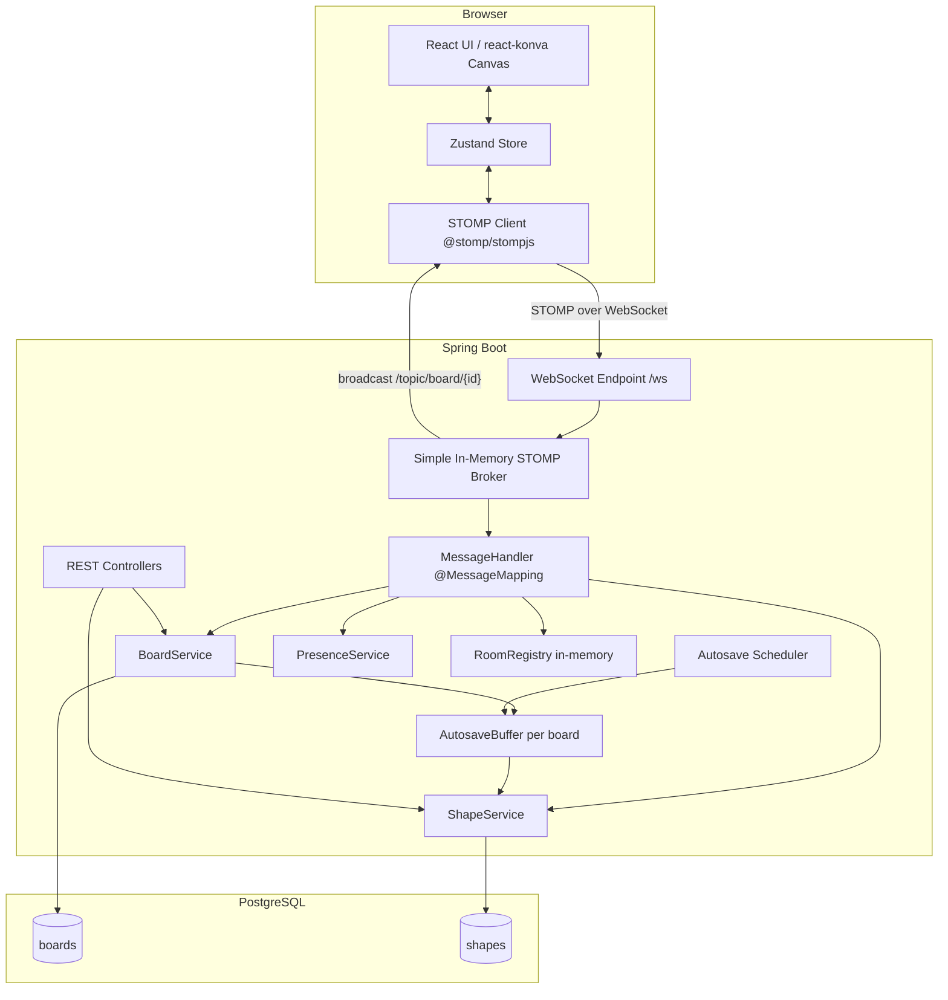

# Design Document — Collaborative Whiteboard (MVP V1)

## Overview

The collaborative whiteboard is a real-time multi-user drawing application. Any number of anonymous users can join a shared board via an unguessable UUID link and see each other's shapes and cursors update live. The system is split into two independently deployable units:

- **Frontend** — React 19 + Vite + Zustand + react-konva, served as a static SPA.
- **Backend** — Spring Boot 4 (Java 17) with Spring WebSocket/STOMP (simple in-memory broker) and PostgreSQL for persistence.

There is no authentication in V1. Identity is a UUID v4 generated on first visit and stored in `localStorage`. Board access is controlled solely by possession of the board's UUID link.

### Key Design Decisions

| Decision | Choice | Rationale |
|---|---|---|
| Conflict strategy | Last-write-wins (server order) | Simple, predictable; no CRDT complexity for MVP |
| Persistence trigger | Autosave buffer, flush every 5 s + on disconnect | Avoids per-stroke DB writes; tolerates brief data loss window |
| Stroke transmission | Incremental STROKE_START / STROKE_APPEND / STROKE_END | Enables live preview without waiting for stroke completion |
| Image support | URL reference only | Avoids file upload infrastructure in MVP |
| Stroke mutability | Movable, not resizable | Simplifies hit-testing; resize of a point array is non-trivial |
| Broker | Spring simple in-memory STOMP broker | Zero external dependencies for MVP; swap to RabbitMQ/Redis later |

---

## Architecture

### High-Level Diagram



### Request / Message Flows

**Board creation:**
```
Browser → POST /api/boards → BoardService → INSERT boards → return {boardId}
Browser navigates to /board/{boardId}
```

**Join flow:**
```
Browser → WebSocket connect /ws
Browser → STOMP SUBSCRIBE /topic/board/{boardId}
Server detects subscription → sends BOARD_SNAPSHOT to subscriber
Server broadcasts USER_JOIN to /topic/board/{boardId}
```

**Stroke flow:**
```
Pointer down → STROKE_START → /app/board/{boardId}
  Server: create in-memory stroke accumulator, broadcast STROKE_START
Pointer move → STROKE_APPEND (≤60 Hz) → /app/board/{boardId}
  Server: append points to accumulator, broadcast STROKE_APPEND
Pointer up → STROKE_END → /app/board/{boardId}
  Server: finalise stroke, mark autosave buffer dirty, broadcast STROKE_END
```

**Autosave flow:**
```
Scheduler (every 1 s) → for each dirty board → flush to DB → mark clean
Disconnect event → immediate flush for that board's buffer
```

---

## Components and Interfaces

### Frontend Components

#### React Component Tree

```
App
├── HomePage          — "/" route, Create Board button
└── BoardPage         — "/board/:boardId" route
    ├── Toolbar       — tool selector, colour/width pickers
    ├── WhiteboardCanvas  — react-konva Stage + Layer
    │   ├── ShapeRenderer — renders all shapes from store
    │   └── CursorLayer   — renders remote cursors
    ├── PresencePanel — active user list + count
    └── ShareBar      — copyable board URL
```

#### Zustand Store Shape

```typescript
interface BoardStore {
  // Identity
  userId: string;

  // Board state
  boardId: string | null;
  shapes: Map<string, Shape>;
  revision: number;

  // Presence
  activeUsers: Map<string, { userId: string; x: number; y: number; lastSeen: number }>;

  // Tool state
  activeTool: 'pen' | 'rectangle' | 'ellipse' | 'text' | 'image' | 'select';
  strokeColor: string;
  fillColor: string;
  strokeWidth: number;
  fontSize: number;

  // In-progress local stroke (optimistic)
  localStroke: { id: string; points: number[] } | null;

  // Actions
  applySnapshot(snapshot: BoardSnapshotMessage): void;
  applyMessage(msg: WsMessage): void;
  setTool(tool: string): void;
  setColor(strokeColor: string, fillColor: string): void;
}
```

#### WebSocket / STOMP Client

The frontend uses `@stomp/stompjs` (to be added as a dependency). A singleton `WsClient` module wraps the STOMP client:

- `connect(boardId, userId)` — opens WebSocket to `/ws`, subscribes to `/topic/board/{boardId}`, sends messages to `/app/board/{boardId}`.
- `disconnect()` — graceful STOMP disconnect.
- `send(message)` — serialises and sends a message to `/app/board/{boardId}`.
- Reconnect: `@stomp/stompjs` built-in reconnect with exponential back-off.

#### Throttling

Cursor moves and text updates are throttled client-side using a simple `lastSent` timestamp guard before calling `WsClient.send()`. Stroke appends are gated by `requestAnimationFrame` (≈16 ms).

### Backend Components

#### Package Structure

```
com.example.collaborative_whiteboard_backend
├── config
│   ├── WebSocketConfig.java       — STOMP endpoint, broker config, CORS
│   └── SchedulerConfig.java       — @EnableScheduling
├── controller
│   ├── BoardRestController.java   — GET/POST /api/boards
│   └── BoardMessageHandler.java   — @MessageMapping /board/{boardId}
├── service
│   ├── BoardService.java          — board CRUD, snapshot assembly
│   ├── ShapeService.java          — shape CRUD, validation
│   ├── PresenceService.java       — join/leave tracking
│   └── AutosaveService.java       — buffer management, scheduled flush
├── model
│   ├── Board.java                 — JPA entity
│   ├── Shape.java                 — JPA entity
│   └── ShapeType.java             — enum: STROKE, RECTANGLE, ELLIPSE, TEXT, IMAGE
├── dto
│   ├── WsMessage.java             — base envelope (boardId, userId, timestamp, revision)
│   ├── StrokeStartMessage.java
│   ├── StrokeAppendMessage.java
│   ├── StrokeEndMessage.java
│   ├── CreateShapeMessage.java
│   ├── UpdateShapeMessage.java
│   ├── DeleteShapeMessage.java
│   ├── TextUpdateMessage.java
│   ├── CursorMoveMessage.java
│   ├── BoardSnapshotMessage.java
│   ├── UserJoinMessage.java
│   └── UserLeaveMessage.java
├── repository
│   ├── BoardRepository.java       — JpaRepository<Board, UUID>
│   └── ShapeRepository.java       — JpaRepository<Shape, UUID>
└── exception
    ├── BoardNotFoundException.java
    ├── ShapeNotFoundException.java
    └── ValidationException.java
```

#### WebSocketConfig

```java
@Configuration
@EnableWebSocketMessageBroker
public class WebSocketConfig implements WebSocketMessageBrokerConfigurer {
    @Override
    public void registerStompEndpoints(StompEndpointRegistry registry) {
        registry.addEndpoint("/ws")
                .setAllowedOriginPatterns("*")
                .withSockJS();
    }

    @Override
    public void configureMessageBroker(MessageBrokerRegistry registry) {
        registry.enableSimpleBroker("/topic");
        registry.setApplicationDestinationPrefixes("/app");
    }
}
```

#### BoardMessageHandler

All inbound STOMP messages arrive at `/app/board/{boardId}`. The handler dispatches on a `type` discriminator field in the message JSON:

```java
@Controller
public class BoardMessageHandler {
    @MessageMapping("/board/{boardId}")
    public void handleMessage(@DestinationVariable String boardId,
                              @Payload String rawJson,
                              SimpMessageHeaderAccessor headerAccessor) {
        // 1. Parse envelope, validate required fields
        // 2. Dispatch to appropriate service method by message type
        // 3. Service returns optional broadcast payload
        // 4. SimpMessagingTemplate.convertAndSend("/topic/board/{boardId}", payload)
    }
}
```

#### PresenceService

Maintains an in-memory `ConcurrentHashMap<String, Set<String>>` mapping `boardId → Set<userId>`. Listens to Spring's `SessionSubscribeEvent` and `SessionDisconnectEvent` to track joins and leaves.

#### AutosaveService

```java
@Service
public class AutosaveService {
    // boardId → dirty flag + pending shape mutations
    private final ConcurrentHashMap<String, AutosaveBuffer> buffers;

    public void markDirty(String boardId) { ... }

    @Scheduled(fixedDelay = 1000)
    public void flushAll() {
        buffers.forEach((boardId, buf) -> {
            if (buf.isDirty()) flushBoard(boardId, buf);
        });
    }

    public void flushOnDisconnect(String boardId) { ... }
}
```

The buffer stores the current in-memory shape state for the board. On flush, it performs a batch upsert of all dirty shapes to PostgreSQL. The 1-second polling interval ensures the 5-second SLA is met with margin.

#### RoomRegistry

An in-memory `ConcurrentHashMap<String, StrokeAccumulator>` per board tracks in-progress strokes (STROKE_START → STROKE_APPEND → STROKE_END). Each accumulator holds the stroke id, owner userId, and accumulated points list.

---

## Data Models

### Database Schema

```sql
CREATE EXTENSION IF NOT EXISTS "pgcrypto";

CREATE TABLE boards (
    id          UUID PRIMARY KEY DEFAULT gen_random_uuid(),
    name        VARCHAR(255) NOT NULL DEFAULT 'Untitled Board',
    created_at  TIMESTAMPTZ  NOT NULL DEFAULT NOW(),
    updated_at  TIMESTAMPTZ  NOT NULL DEFAULT NOW()
);

CREATE TYPE shape_type AS ENUM ('stroke', 'rectangle', 'ellipse', 'text', 'image');

CREATE TABLE shapes (
    id           UUID PRIMARY KEY,
    board_id     UUID         NOT NULL REFERENCES boards(id) ON DELETE CASCADE,
    type         shape_type   NOT NULL,
    x            DOUBLE PRECISION,
    y            DOUBLE PRECISION,
    width        DOUBLE PRECISION,
    height       DOUBLE PRECISION,
    stroke_color VARCHAR(50),
    fill_color   VARCHAR(50),
    stroke_width DOUBLE PRECISION,
    points       JSONB,
    text_content VARCHAR(1000),
    font_size    INTEGER,
    src          VARCHAR(2048),
    created_by   UUID         NOT NULL,
    created_at   TIMESTAMPTZ  NOT NULL DEFAULT NOW(),
    updated_at   TIMESTAMPTZ  NOT NULL DEFAULT NOW()
);

CREATE INDEX idx_shapes_board_id ON shapes(board_id);
```

Schema migrations are managed with Flyway. The initial migration file is `V1__init.sql`.

### JPA Entities

**Board.java**
```java
@Entity @Table(name = "boards")
@Data @NoArgsConstructor
public class Board {
    @Id
    private UUID id;
    private String name;
    private OffsetDateTime createdAt;
    private OffsetDateTime updatedAt;
}
```

**Shape.java**
```java
@Entity @Table(name = "shapes")
@Data @NoArgsConstructor
public class Shape {
    @Id
    private UUID id;

    @ManyToOne(fetch = FetchType.LAZY)
    @JoinColumn(name = "board_id")
    private Board board;

    @Enumerated(EnumType.STRING)
    private ShapeType type;

    private Double x, y, width, height;
    private String strokeColor, fillColor;
    private Double strokeWidth;

    @Column(columnDefinition = "jsonb")
    private String points;          // JSON array of {x,y} objects

    private String textContent;
    private Integer fontSize;
    private String src;
    private UUID createdBy;
    private OffsetDateTime createdAt;
    private OffsetDateTime updatedAt;
}
```

### WebSocket Message DTOs

All messages share a base envelope:

```java
// Base envelope — all inbound and outbound messages include these fields
public class WsMessage {
    private String type;        // message type discriminator
    private String boardId;     // UUID string
    private String userId;      // UUID string
    private String timestamp;   // ISO-8601 UTC
    private int    revision;    // non-negative integer
}
```

**Inbound message types:**

| Type | Additional Fields |
|---|---|
| `STROKE_START` | `shapeId`, `color`, `strokeWidth`, `x`, `y` |
| `STROKE_APPEND` | `shapeId`, `points: [{x,y}]` |
| `STROKE_END` | `shapeId` |
| `CREATE_SHAPE` | `shapeId`, `shapeType`, `x`, `y`, `width`, `height`, `strokeColor`, `fillColor`, `strokeWidth`, `src` |
| `UPDATE_SHAPE` | `shapeId`, `x`, `y`, `width`, `height` |
| `DELETE_SHAPE` | `shapeId` |
| `TEXT_UPDATE` | `shapeId`, `textContent` |
| `CURSOR_MOVE` | `x`, `y` |

**Outbound message types (broadcast):**

| Type | Description |
|---|---|
| `BOARD_SNAPSHOT` | Full shape array + revision, sent to joining client only |
| `STROKE_START` | Relayed to other subscribers |
| `STROKE_APPEND` | Relayed to other subscribers |
| `STROKE_END` | Relayed to other subscribers |
| `CREATE_SHAPE` | Relayed to other subscribers |
| `UPDATE_SHAPE` | Relayed to other subscribers |
| `DELETE_SHAPE` | Relayed to other subscribers |
| `TEXT_UPDATE` | Relayed to other subscribers |
| `CURSOR_MOVE` | Relayed to other subscribers (not persisted) |
| `USER_JOIN` | Broadcast on new connection |
| `USER_LEAVE` | Broadcast on disconnect |
| `ERROR` | Sent only to originating client |

### Frontend Shape Model

```typescript
type ShapeType = 'stroke' | 'rectangle' | 'ellipse' | 'text' | 'image';

interface Shape {
  id: string;
  type: ShapeType;
  x: number;
  y: number;
  width?: number;
  height?: number;
  strokeColor: string;
  fillColor?: string;
  strokeWidth: number;
  points?: number[];      // flat array [x0,y0,x1,y1,...] for Konva Line
  textContent?: string;
  fontSize?: number;
  src?: string;
  createdBy: string;
}
```

---

## Correctness Properties

*A property is a characteristic or behavior that should hold true across all valid executions of a system — essentially, a formal statement about what the system should do. Properties serve as the bridge between human-readable specifications and machine-verifiable correctness guarantees.*

### Property 1: userId persistence across page loads

*For any* browser session where `localStorage` is available, the `userId` read on a subsequent visit SHALL equal the `userId` generated and stored on the first visit.

**Validates: Requirements 1.1, 1.2**

---

### Property 2: Whitespace-only and empty text content is rejected

*For any* `TEXT_UPDATE` message where `textContent` is composed entirely of whitespace characters or exceeds 1000 characters, the server SHALL reject the message and the shape's stored `textContent` SHALL remain unchanged.

**Validates: Requirements 7.5**

---

### Property 3: Shape count cap is enforced

*For any* board and any sequence of `CREATE_SHAPE` or `STROKE_END` messages, the total number of persisted shapes for that board SHALL never exceed 1000.

**Validates: Requirements 11.1**

---

### Property 4: Message envelope round-trip integrity

*For any* valid outbound broadcast message, the `boardId`, `userId`, `timestamp`, and `revision` fields in the broadcast SHALL match the values from the accepted inbound message that triggered it.

**Validates: Requirements 18.1, 18.3**

---

### Property 5: Snapshot completeness

*For any* board with N persisted shapes, the `BOARD_SNAPSHOT` message sent to a joining client SHALL contain exactly N shape objects, and each shape object SHALL include all non-null fields stored in the database for that shape.

**Validates: Requirements 3.1, 3.2, 3.5**

---

### Property 6: Stroke point accumulation is bounded

*For any* in-progress stroke, the server SHALL reject `STROKE_APPEND` messages once the accumulated point count reaches 5000, and the total stored point count for that stroke SHALL never exceed 5000.

**Validates: Requirements 4.5**

---

### Property 7: Rectangle and ellipse dimension validation

*For any* `CREATE_SHAPE` message with `type` of `rectangle` or `ellipse`, if `width` ≤ 0 or `height` ≤ 0, the server SHALL reject the message and no shape SHALL be persisted or broadcast.

**Validates: Requirements 5.4, 6.4**

---

### Property 8: Last-write-wins ordering

*For any* sequence of `UPDATE_SHAPE` messages for the same `shapeId` received by the server, the final persisted state of that shape SHALL equal the state specified in the last received message in that sequence.

**Validates: Requirements 14.1, 14.2**

---

### Property 9: Autosave buffer dirty-then-flush

*For any* board that receives at least one shape mutation, the server SHALL flush all pending mutations to PostgreSQL within 5000 ms of the mutation being processed, and the `updated_at` timestamp on the board record SHALL be updated on each flush.

**Validates: Requirements 15.1, 15.2, 15.5**

---

### Property 10: DELETE_SHAPE removes shape from subsequent snapshots

*For any* board, after a `DELETE_SHAPE` message for shape S is successfully processed, any subsequent `BOARD_SNAPSHOT` sent to a joining client SHALL not contain shape S.

**Validates: Requirements 10.2, 10.3**

---

## Error Handling

### Server-Side Error Strategy

All validation errors are returned as `ERROR` messages sent only to the originating client via `SimpMessagingTemplate.convertAndSendToUser()`. Errors are never broadcast to the room.

**Error message structure:**
```json
{
  "type": "ERROR",
  "boardId": "...",
  "userId": "...",
  "timestamp": "...",
  "revision": 0,
  "code": "VALIDATION_ERROR | NOT_FOUND | SHAPE_LIMIT_EXCEEDED | STROKE_POINT_LIMIT | MISSING_FIELD",
  "message": "Human-readable description"
}
```

**Validation rules enforced by the server:**

| Condition | Error Code | HTTP/WS |
|---|---|---|
| Missing envelope field | `MISSING_FIELD` | WS ERROR |
| Board not found | `NOT_FOUND` | HTTP 404 / WS ERROR |
| Shape not found | `NOT_FOUND` | WS ERROR |
| width or height ≤ 0 | `VALIDATION_ERROR` | WS ERROR |
| textContent > 1000 chars | `VALIDATION_ERROR` | WS ERROR |
| Shape count > 1000 | `SHAPE_LIMIT_EXCEEDED` | WS ERROR |
| Stroke points > 5000 | `STROKE_POINT_LIMIT` | WS ERROR |

### Client-Side Error Handling

- **WS ERROR messages**: displayed as a dismissible toast notification.
- **Board not found (HTTP 404)**: `BoardPage` renders a "Board not found" full-page message.
- **Image load failure**: react-konva `Image` component falls back to a placeholder rectangle with an error icon.
- **WebSocket disconnect**: `@stomp/stompjs` reconnects automatically with exponential back-off (initial 500 ms, max 30 s). A "Reconnecting…" banner is shown while disconnected.
- **Board creation timeout**: if `POST /api/boards` does not respond within 5 s, the client shows an error and re-enables the "Create Board" button.

### Concurrency and Thread Safety

- `AutosaveService.buffers` uses `ConcurrentHashMap` with per-board `ReentrantLock` during flush to prevent double-flush races.
- `PresenceService` uses `ConcurrentHashMap<String, CopyOnWriteArraySet<String>>` for the user set per board.
- `RoomRegistry` stroke accumulators use `ConcurrentHashMap`; individual accumulators are accessed only from the single STOMP message-handling thread for a given session.

---

## Testing Strategy

### Backend (Java / JUnit 5 + jqwik)

**Unit tests** cover:
- `ShapeService` validation logic (dimension checks, text length, shape limit, stroke point limit).
- `AutosaveService` dirty/flush state machine.
- `PresenceService` join/leave tracking.
- Message envelope validation in `BoardMessageHandler`.

**Property-based tests** use **jqwik** (a JUnit 5 property-based testing library for Java). Each property test runs a minimum of 100 tries (`@Property(tries = 100)`).

Property tests are tagged with `@Tag("property")` and a comment referencing the design property:
```java
// Feature: collaborative-whiteboard, Property 3: shape count cap is enforced
@Property(tries = 200)
void shapeCountCapIsEnforced(@ForAll @IntRange(min = 1001, max = 1500) int attemptCount) { ... }
```

**Integration tests** use `@SpringBootTest` with an embedded H2 database (JSONB columns mapped to CLOB for H2 compatibility) or Testcontainers PostgreSQL:
- Full WebSocket message flow (connect → snapshot → mutate → disconnect).
- REST endpoint responses and status codes.
- Autosave flush triggered by disconnect.

### Frontend (Vitest + @testing-library/react + fast-check)

**Unit tests** cover:
- Zustand store reducers: `applySnapshot`, `applyMessage` for each message type.
- `WsClient` throttle logic.
- URL validation for image shapes.
- `userId` generation and localStorage persistence.

**Property-based tests** use **fast-check** (a TypeScript/JavaScript PBT library). Each property test runs a minimum of 100 iterations.

Property tests are tagged with a comment:
```javascript
// Feature: collaborative-whiteboard, Property 5: snapshot completeness
test.prop([fc.array(arbitraryShape(), { minLength: 0, maxLength: 1000 })])(
  'snapshot replaces local state completely',
  (shapes) => { ... }
);
```

**Component tests** use `@testing-library/react`:
- `Toolbar` renders all tools and fires correct store actions.
- `PresencePanel` updates when `USER_JOIN` / `USER_LEAVE` messages arrive.
- `ShareBar` displays and copies the board URL.

### CI Pipeline

Backend and frontend test jobs run in parallel in GitHub Actions. The backend job runs `./mvnw verify` (which includes unit + property + integration tests). The frontend job runs `npm ci && npm run lint && npm run build` plus `npx vitest --run` for the test suite.

### Test Coverage Targets

| Layer | Target |
|---|---|
| Backend service layer | ≥ 80% line coverage |
| Frontend store logic | ≥ 80% line coverage |
| Property tests | ≥ 100 iterations each |
